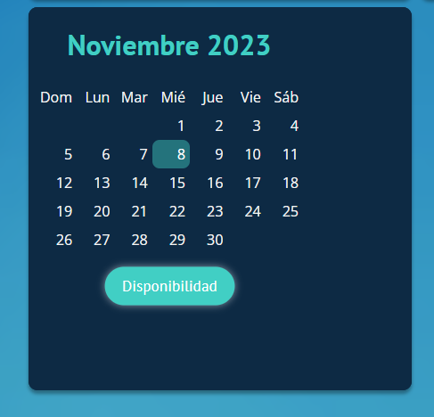
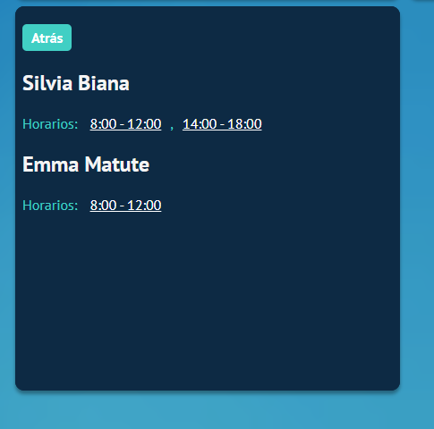
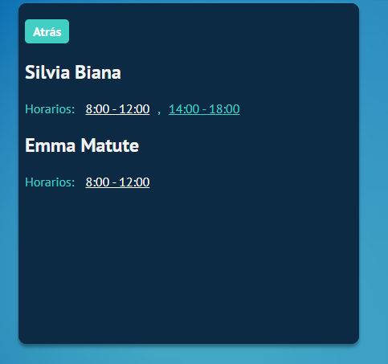
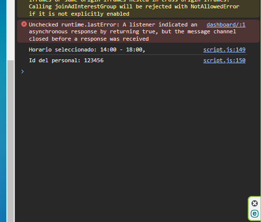
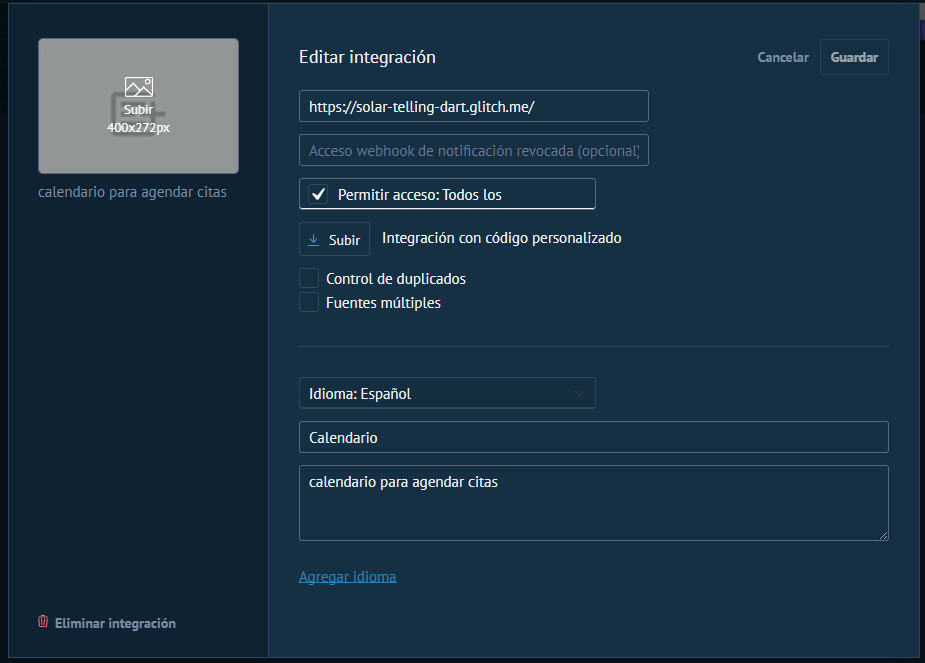

# Prueba Widget de Calendario - Alex Noel
___
En este pequeño readme explicare la funcionalidad del widget y lo que pude lograr hasta el momento:

1. Podemos visualizar el widget del calendario.

  

2. En él, podrán seleccionar una fecha específica y luego presionar el botón de disponibilidad para ver si existe un personal disponible para la fecha, ahí se hace un fetch a la api dummy creada.

  

3. Al pulsar el botón nos enviara a la pestaña donde se visualiza el personal disponible y sus horarios respectivos.

  

4. Al seleccionar una fecha, podemos ver como se envían los datos correspondientes, que sería el id del personal y la fecha seleccionada, en este caso de prueba solo hago un console log.

  
  

___

Para finalizar, probe usar la integracion de kommo, para poder acceder al id del cliente que hace esa petición, y poder usar ese id para agendar la cita.

Este es el paso que estuve viendo:

  

En teoría de esta forma me daría unas credenciales para poder acceder a la API de Kommo y poder usar los datos de ahí, pero no tuve mucho exito en eso, sin embargo intente algunas cosas que puede revisar en mi codigo de script.js

Fue un trabajo bastante entretenido, la verdad. Me gustaría poder capacitarme en esta herramienta para desempeñar de manera excelente el rol que están buscando 🙌✨.